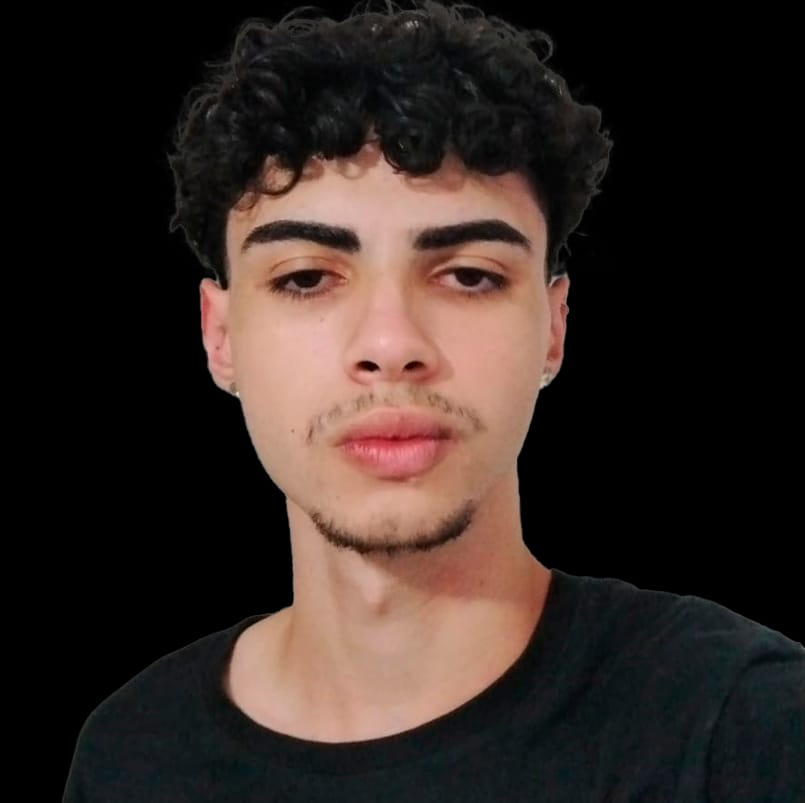
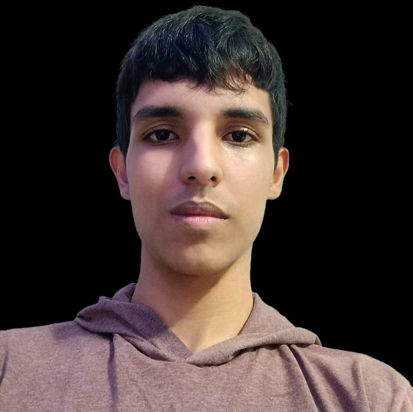
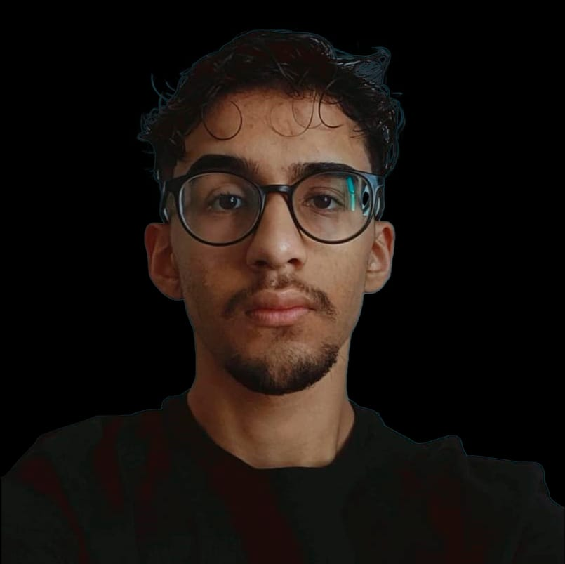
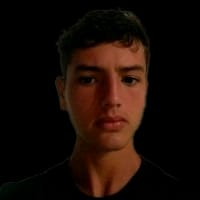

<h1 align="center"> Second Vision </h1>  

  

  Second Vision, uma nova forma de enxergar o mundo para aqueles que não o podem ver.

## Tabela de Conteúdos

- [Introdução](#Introdução)
- [Documentação](#Documentação)
- [Desenvolvedores](#Desenvolvedores)

## Introdução

Este repositório contém o código e a documentação do Trabalho de Conclusão de Curso (TCC) dos alunos da ETEC da Zona Leste. Esse TCC consiste em um dispositivo de microcomputador projetado para auxiliar deficientes visuais na detecção de objetos potencialmente perigosos no ambiente metropolitano.

O dispositivo utiliza uma câmera integrada para capturar imagens do ambiente ao redor do usuário e, em seguida, processa essas imagens em tempo real para identificar objetos potencialmente perigosos, como obstáculos. Quando um objeto perigoso é detectado, o dispositivo emite alertas sonoros através de uma aplicação mobile para notificar o usuário sobre a presença do objeto.

O objetivo deste projeto é aumentar a autonomia e segurança das pessoas com deficiência visual em suas atividades diárias, proporcionando-lhes uma ferramenta acessível e eficaz para detectar e evitar obstáculos nas metrópoles.

## Documentação

Aqui estão alguns documentos construídos ao decorrer do trabalho: 

* Monografia
* Diagrama de Casos de Uso
* Diagrama de Máquina-Estado
* Diagrama de Classe
* Diagrama de Sequência
* Diagrama de Atividade
* Wireframes
  
## Desenvolvedores

Obrigado pela dedicação e foco de todos os envolvidos!

# Autores
| [ Gustavo Mendes Ventieri Mariano](https://github.com/gustavoventieri/) |  [ Nickolas Maia de Araujo](https://github.com/nickolss)  |  [ Pedro Fernandes Araújo](https://github.com/PedroFAraujo) | [ Tiago Bryan Ramos de Oliveira](https://github.com/TiagoBryan) | 
| :---: | :---: | :---: | :---: |
